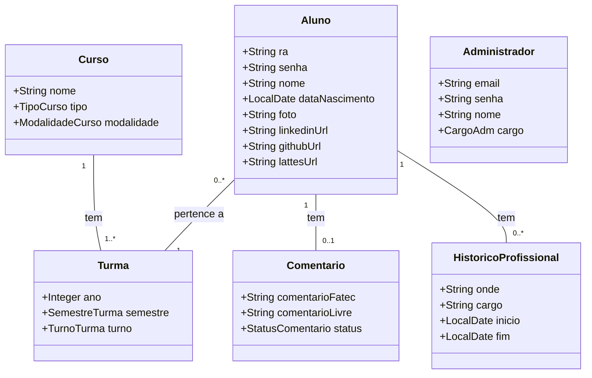

# Aplicação de Carômetro para a Fatec
Aplicação web para conectar ex-alunos da Fatec, permitindo o gerenciamento de informações sobre alunos, turmas e cursos.
O sistema implementa diferentes níveis de acesso utilizando Spring Security para garantir a segurança e a integridade dos dados.
Alunos podem compartilhar seus históricos profissionais e opiniões sobre a faculdade, sujeitos à moderação por administradores.
Funcionalidades avançadas como pesquisa, paginação e ordenação estão presentes, juntamente com regras de negócio que asseguram que cada usuário interaja apenas com os dados pertinentes ao seu nível de acesso.


## Diagrama de classes



## Resumo do projeto
- A ideia geral do projeto é que alunos possam encontrar outros alunos formados na faculdade.
- Nele há dois tipos de usuários: administradores e alunos.
- O cadastro, de administradores e alunos, é feito por um administrador existente.
- O administrador pode gerenciar: cursos, turmas, alunos, comentários, profissões e administradores.
- As seis entidades acimas podem ser cadastradas, lidas, editadas e deletadas.


## Regras de negócios
1. **Todos os usuários**
- Pode visualizar a página inicial.
- Pode realizar login.
- Pode pesquisar alunos.
- Pode visualizar perfil de alunos.

2. **Administrador**
- Possui permissão para manipular (CRUD) todas as entidades do sistema.
- Pode realizar o cadastro de novos alunos e administradores.
- Tem capacidade de editar o perfil de qualquer aluno ou administrador.
- Determina se os comentários são válidos ou não.

3. **Aluno**
- Pode gerenciar apenas os próprios dados: perfil, comentário e profissões.
- Tem capacidade de manipular apenas os próprios comentários.
  - Ao criar ou editar um comentário, ele ficará em aguardo até que o administrador aprove.
  - Comentários em aguardo são visíveis apenas a quem fez o comentário e aos administradores.
  - Se for recusado, o aluno poderá fazer outra tentativa.


## Funcionalidades
- [x] URLs amigáveis seguindo o padrão RESTful.
- [x] Fragments do Thymeleaf para reaproveitamento de código.
- [x] Validação dos dados dos formulários no front-end e back-end.
- [x] Formulários inválidos enviados são retornados preenchidos e informam o erro.
- [x] Implementação de DTO para prevenir Web Parameter Tampering.
- [x] Utilização de janela de confirmação para deletar objetos.
- [x] Configuração de diferentes perfis para ambientes de desenvolvimento e testes.
- [x] Implementação de validação para evitar dados duplicados na criação ou atualização de entidades.
- [x] Funcionalidade de pesquisa para turmas, alunos e profissões.
- [x] Gerenciamento de imagem de perfil do aluno:
    - [ ] Permite o upload de uma imagem de perfil, armazenada localmente na aplicação.
    - [ ] Exibe a imagem de perfil do aluno, caso uma tenha sido cadastrada.
    - [ ] Apresenta um placeholder visual ("Sem Foto") quando o aluno não possui imagem de perfil.
- [x] Elaboração de testes unitários com JUnit:
    - [x] Ativa o perfil de teste com `@ActiveProfiles("test")` a cada teste.
    - [x] Da camada Repository para todas as entidades.
    - [ ] Da camada Controller utilizando Mockito.
- [x] Implementação de controle de acesso com Spring Security:
  - [x] Configuração de um administrador padrão inicial (em memória).
  - [x] Autenticação de usuários (alunos e administradores).
  - [x] Mecanismo de autorização baseada em roles (perfis de acesso).
  - [x] Proteção de endpoints, permitindo o acesso apenas ao dono e administradores.
  - [x] Adaptação da interface do usuário com base nas permissões do usuário logado.
- [x] Tratamento de erros:
  - [x] Apresentação de erros em páginas personalizadas e informativas
  - [x] Tratamento de erros HTTP comuns (403 - Forbidden, 404 - Not Found, 500 - Internal Server Error).
  - [x] Tratamento de exceções globais (DataIntegrityViolationException, AuthorizationDeniedException etc).
- [ ] Implementação de paginação e ordenação em todas páginas.


## Instalação e Execução
Para executar esse projeto e testar todas suas funcionalidades:


### Utilizando Docker
1. **Requisitos**
    * Ter o Docker Desktop _instalado_ e em _execução_.

2. **Configuração do Docker**
    * Crie os contêineres e inicie a aplicação junto ao banco de dados.
    * Para isso, execute o seguinte comando no terminal na **raiz do projeto**:

    ```bash
    docker-compose up -d --build
    ```

3. **Acesse a aplicação**
    * Acesse na porta [8080](http://localhost:8080/) da aplicação.
    * Na primeira execução, aguarde cerca de 30s para o banco de dados ser criado.

4. **Faça login como administrador**
    * **E-mail:** admin@fatec.sp.gov.br
    * **Senha:** 123456

5. **Observação**
    * A funcionalidade de exibição das imagens dos alunos ainda não está funcionando.
    * Para testá-la, utilize a alternativa abaixo.


### Utilizando SQL Server
1. **Crie o banco de dados**
    * Chame ele de `carometro1`.
    * Não crie tabelas - elas serão geradas automaticamente pelo Hibernate.

2. **Configure a conexão com o banco de dados**
    * Acesse o arquivo [application-dev.properties](https://github.com/wastecoder/lab-bd-carometro/blob/main/src/main/resources/application-dev.properties).
    * Altere a `url`, `username` e `password` com os dados do seu SQL Server local.

3. **Execute e entre na aplicação**
    * Execute a classe **CarometroApplication**.
    * Acesse a aplicação na porta [8080](http://localhost:8080/).
