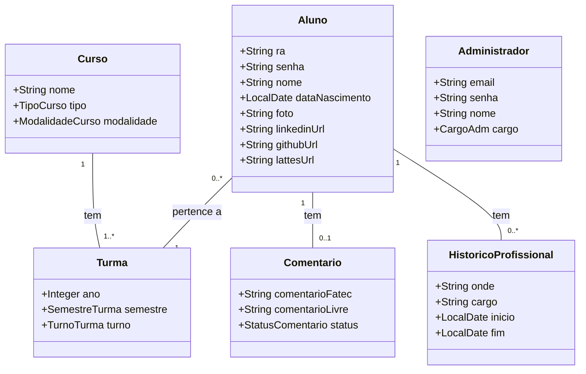

# Aplicação de Carômetro para a Fatec
Aplicação web para gerenciamento de alunos, turmas e cursos, com diferentes níveis de acesso usando Spring Security.
Alunos podem registrar históricos profissionais e comentários sobre a faculdade, os quais são sujeitos à validação de um administrador.
O sistema oferece funcionalidades de pesquisa, paginação e ordenação, com regras de negócio que garantem que cada usuário manipule apenas os dados permitidos para seu nível de acesso.

## Diagrama de classes

## Resumo do projeto
- A ideia geral do projeto é que alunos possam encontrar outros alunos formados na faculdade.
- Nele há dois tipos de usuários: administradores e alunos.
- O cadastro, de administradores e alunos, é feito por um administrador existente.
- O administrador pode gerenciar: cursos, turmas, alunos, comentários, profissões e administradores.
- As seis entidades acimas podem ser cadastradas, lidas, editadas e deletadas.

## Instalação
Após clonar e importar o repositório, basta configurar o banco de dados:
- No seu servidor local, crie o banco de dados __carometro1__, sem tabelas.
- No arquivo **application.properties** altere a _url, username e password_ adequado ao seu servidor.
- Execute o arquivo **CarometroApplication** e entre na porta [8080](http://localhost:8080/).
- __OBS:__ outra possibilidade é usar o banco de dados em memória __H2__, configurado no perfil __test__.

## Regras de negócios
1. Todos
- Pode visualizar a página inicial
- Pode fazer cadastro e login
- Pode pesquisar alunos
- Pode visualizar perfil de alunos
3. Administrador
- Pode manipular todas entidades
- Pode editar o perfil de qualquer aluno
- Determina se os comentários são válidos ou não
4. Aluno
- Pode manipular apenas o próprio perfil e histórico profissional
- Pode manipular apenas os próprios comentários
    - Ao criar ou editar, ficarão em aguardo até que o administrador aceite.
    - Comentários em aguardo são visíveis apenas a quem fez o comentário e aos administradores.
    - Se for recusado, o aluno poderá fazer outra tentativa.

## Funcionalidades
- [x] Friendly URL no padrão REST
- [x] Fragments do Thymeleaf para reaproveitamento de código
- [x] Dados dos formulários são validados no HTML e Spring
- [x] Formulários inválidos são retornados preenchidos e informam o erro
- [x] Usa DTO para prevenir Web Parameter Tampering
- [x] Janela de confirmação para deletar objetos
- [x] Diferentes perfies para desenvolvimento e testes
- [x] Testes da camada repository de todas entidades
- [x] Não aceita registros repetidos ao criar ou atualizar os mesmos
- [x] Pesquisa de turmas, alunos e profissões
- [ ] Paginação e ordenação em todas páginas
- [ ] Controle de acesso com Spring Security
